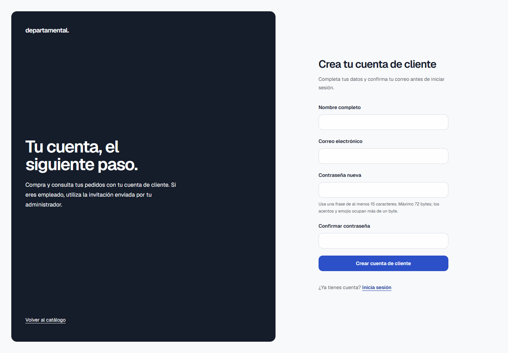
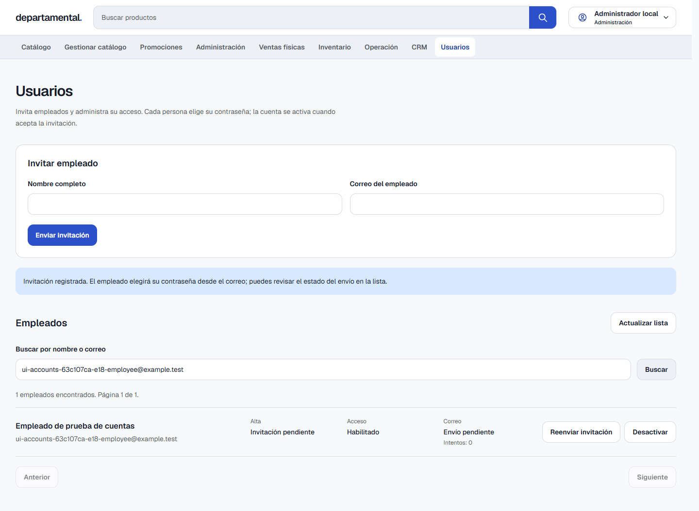

# Alta de clientes y empleados: entrega y demostración

Fecha: 9 de octubre de 2026. Alcance: fases 6–8 del [plan de cuentas](plan-alta-cuentas.md), sobre el backend y las sesiones de las fases 1–5.

El cliente se registra desde el login y confirma su correo. ADMIN invita empleados desde Usuarios; cada empleado establece su propia contraseña. El rol lo decide Auth: estos formularios no crean administradores. El entorno de demostración utiliza SMTP de captura; las bases del proyecto de negocio no se migraron durante esta entrega.

## Demostrar el alta de un cliente

1. Abre [la aplicación de pruebas](http://localhost:3105) sin sesión. Opcionalmente agrega un producto a la bolsa y entra a **Ver bolsa**: aparecerá el login con retorno a checkout.
2. Pulsa **Crear cuenta**. Introduce nombre, un correo nuevo y una frase de acceso de al menos 15 caracteres; repítela. No existe selector de rol.
3. Envía el registro. La respuesta pide revisar el correo; todavía no existe una sesión autorizada.
4. Abre [Mailpit](http://localhost:18025), encuentra el mensaje dirigido al correo utilizado y abre su enlace. Abrirlo no activa la cuenta: pulsa **Confirmar mi correo**.
5. Pulsa **Iniciar sesión** y utiliza tus credenciales. Si empezaste desde checkout, regresarás allí con la bolsa conservada. Selecciona una sucursal y confirma el pedido para demostrar una compra real.
6. Visita `/users`: el cliente recibe la pantalla de acceso restringido.

Mailpit captura mensajes de pruebas; no los entrega a un buzón externo. Para una demostración, usa una dirección sintética propia que no se haya utilizado antes. No muestres contraseñas, cookies ni enlaces completos en capturas compartidas.

Si confirmas el correo en otro navegador, la página solicita establecer y repetir una contraseña nueva. El enlace no inicia sesión automáticamente. Un enlace vencido o ya utilizado permite solicitar otra verificación; las respuestas públicas no revelan si existe una cuenta.

## Demostrar el alta y la administración de un empleado

1. Inicia sesión como ADMIN en la aplicación de pruebas. La cuenta de desarrollo es `admin@departamental.local`; su contraseña se encuentra en la variable privada `SEED_ADMIN_PASSWORD` de `.env.integration`, fuera de Git.
2. Abre **Usuarios**. Introduce nombre y un correo nuevo en **Invitar empleado** y pulsa **Enviar invitación**. ADMIN no introduce la contraseña del empleado.
3. Busca el correo en la lista. Comprueba por separado **Alta**, **Acceso** y **Correo**. El correo enviado todavía no significa que se aceptó la invitación.
4. Abre el mensaje correspondiente en Mailpit. En otra sesión del navegador, abre el enlace y establece la contraseña del empleado. Pulsa **Aceptar invitación** y después inicia sesión.
5. Comprueba que el empleado entra en `/operations` y que no aparece Usuarios en su navegación. Visitar `/users` directamente también restringe el acceso.
6. Desde ADMIN actualiza la lista. Pulsa **Desactivar**, revisa la explicación y cancela con Escape. Repite y confirma: la cuenta queda desactivada, no puede renovar sesión y sus APIs y conexiones abiertas se bloquean en un máximo de **35 segundos**.
7. Pulsa **Habilitar** y confirma. El empleado debe iniciar sesión nuevamente; las sesiones anteriores siguen revocadas. Si su invitación estaba pendiente, debes reenviarla después de habilitarlo.

Para demostrar reenvíos, utiliza un empleado todavía pendiente y espera al menos 60 segundos desde el envío anterior. **Reenviar invitación** sustituye el enlace anterior. Los conflictos por correo existente no convierten clientes ni administradores en empleados. Un reintento de la misma invitación después de perder la respuesta conserva la clave idempotente y no crea otra identidad.

## Pantallas y seguridad

| Ruta | Acceso | Función |
| --- | --- | --- |
| `/login` | Público | Iniciar sesión y entrar a Crear cuenta |
| `/register` | Público | Registro de CUSTOMER y confirmación de contraseña |
| `/verify-email` | Público con desafío válido | Confirmación explícita y recuperación mediante reenvío |
| `/accept-invitation` | Público con desafío válido | Contraseña elegida por el empleado y aceptación única |
| `/users` | ADMIN | Invitación, búsqueda paginada, estados, reenvío y habilitación |

Los formularios incluyen validación asociada a cada campo, foco en el primer error, mensajes accesibles, controles deshabilitados mientras se procesa la operación y recuperación de errores de red. Se verifican vistas de escritorio, móvil y tema oscuro. La bolsa anónima se incorpora una sola vez a la bolsa del cliente después del login; las bolsas de otras cuentas mantienen su separación. La compra sigue exigiendo un cliente autorizado.

Las contraseñas nuevas requieren 15 caracteres y como máximo 72 bytes UTF-8, sin truncamiento. Las contraseñas anteriores siguen admitidas en el login. Los tokens se leen del fragmento del enlace, se retiran de la barra y permanecen solo en memoria hasta el POST. Refrescar esa página exige volver a abrir el enlace original. Los retornos `next` se limitan a rutas locales autorizadas para el rol.

Las mutaciones del BFF validan origen y CSRF. Cookies de sesión y nonce son HTTP-only. Kong y Auth aplican límites independientes: como base, 10 intentos por IP cada 15 minutos, 60 segundos entre envíos y 3 reenvíos por hora. Las pruebas repetidas desde la misma IP deben respetar la ventana; no se eliminan contadores para evitarlos.

Se actualizaron `next`, `@next/env` y `eslint-config-next` de 16.3.2 a 16.3.8, junto con parches compatibles del lockfile. La auditoría `npm audit --omit=dev` reportó **0 vulnerabilidades**. La auditoría completa conserva cinco entradas de severidad alta en la cadena de ESLint por una misma vulnerabilidad de `braces`, sin versión corregida publicada; no se aplicó la degradación incompatible que propone `--force`. La imagen de ejecución excluye dependencias de desarrollo: se comprobó dentro del contenedor que ESLint y braces están ausentes. Consulta el [aviso de braces](https://github.com/advisories/GHSA-vfj7-8cjw-p6xm) y el [aviso corregido de Next.js para Windows](https://github.com/vercel/next.js/security/advisories/GHSA-p293-qw3h-jr36).

Los contratos, permisos, variables, cifrado, auditoría y estados del backend se describen en [la implementación de las fases 1–5](implementacion-alta-cuentas-fases-1-5.md). Los estados de entrega `PENDING`, `PROCESSING`, `SENT`, `SIMULATED`, `FAILED` y `UNDELIVERABLE` son independientes del alta `PENDING_EMAIL`, `PENDING_INVITATION` o `READY`.

## Reproducir las comprobaciones

Ejecuta los comandos desde `web` con Node.js disponible. El entorno aislado usa el proyecto Compose `departamental-five-phases`; no utilices estos runners contra las bases de negocio.

```powershell
npm ci
npm run lint -- src tests scripts e2e playwright.accounts.config.ts
npm run typecheck
npm test
npm run build
node scripts/setup-integration.mjs
docker compose -p departamental-five-phases --env-file .env.integration -f compose.yaml -f compose.integration.yaml up -d --build --wait --wait-timeout 180
$env:PLAYWRIGHT_CHANNEL = 'msedge'
npm run test:accounts-browser
node scripts/verify-accounts-races.mjs
```

En Windows, las pruebas se verificaron con Edge instalado. Para usar Chromium de Playwright, elimina `PLAYWRIGHT_CHANNEL` e instala el navegador mediante `npx playwright install chromium`; en Linux CI utiliza `npx playwright install --with-deps chromium`.

El runner de navegador recorre cuatro escenarios: compra desde bolsa anónima y registro, administración completa de empleados con reintento de invitación, confirmación desde otro navegador y recuperación móvil con fallo de red. El runner de concurrencia ejecuta tres carreras de reenvío frente a aceptación y cinco de desactivación frente a refresh. Solo modifica usuarios sintéticos del entorno aislado.

Los reportes excluyen contraseñas, tokens y enlaces completos; las trazas, videos y capturas automáticas de fallos están deshabilitados. Una prueba de regresión comprueba que el reporter no publique los valores introducidos por Playwright. Las capturas de demostración corresponden a cuentas sintéticas y formularios sin contraseñas visibles.

La comprobación conjunta anterior se puede repetir con `node scripts/verify-accounts-first-five.mjs`. Incluye estados, privilegios, CSRF, desafíos, concurrencia, correo, recuperación de servicios y revocación de APIs y socket. Las regresiones del módulo anterior se reproducen con `node scripts/verify-five-phases.mjs` y `node scripts/verify-final-phases.mjs`. Estos comandos pueden interrumpir y restaurar servicios exclusivamente aislados; ejecútalos secuencialmente.

La configuración de GitHub Actions agrega el flujo completo de navegador y SMTP, carreras y reportes sanitizados, además de lint, TypeScript, pruebas y build de la web y los diez servicios. Su ejecución remota requiere publicar los cambios; la comprobación de esta entrega se realizó localmente.

## Respaldo y preparación del entorno de negocio

```powershell
node scripts/backup-account-databases.mjs --project web --start-stopped
```

El script comprueba las etiquetas del proyecto, respalda Auth y Notification y escribe los dumps y un manifest privado en `../.codex-backups/accounts-release/`, fuera del repositorio. Cuando se indica `--start-stopped`, arranca únicamente los PostgreSQL necesarios y vuelve a detener los que estaban detenidos.

Restaura ambos respaldos en un PostgreSQL temporal sin puertos ni red externa y aplica allí las migraciones de cuentas. Compara las identidades completas y los registros de refresh antes y después. El ensayo conservó los **3 usuarios y los 931 registros de sesión** del proyecto `web`, incluidos IDs, roles y hashes de contraseña. El contenedor temporal se retiró al terminar. **Las bases de negocio siguen sin migrar**; el respaldo y el ensayo preparan la entrega.

Para una publicación pública se requiere `NOTIFICATION_DELIVERY_MODE=smtp`, un `SMTP_URL` válido, remitente autorizado, `APP_PUBLIC_ORIGIN` HTTPS y coherencia entre origen, CORS y proxy. Las cuatro claves del módulo deben generarse de forma independiente y mantenerse privadas. Deshabilita seeds y utiliza valores de producción. El modo `log` solo registra `SIMULATED`: no entrega correo ni permite completar el alta desde un mensaje real.

## Evidencia

La ejecución de navegador terminó el 9 de octubre de 2026 a las **08:15:52 UTC**, con los cuatro escenarios aprobados. Pasaron **142 pruebas de la web** (135 Vitest y 7 de IP), lint, TypeScript y el build de Docker con Next.js 16.3.8. Los diez servicios conservan las **196 pruebas aprobadas** del punto de control anterior; el conjunto local suma **338 pruebas**. Las ocho carreras adicionales y el ensayo de respaldo también pasaron. La imagen está funcionando en el entorno aislado con sus 26 contenedores saludables. CI quedó configurado; no se ha ejecutado remotamente para estos cambios.

La revisión visual final del módulo emitió **`disposition: ship`**, sin correcciones materiales, después de inspeccionar las doce capturas de escritorio y móvil. La dirección conserva el sistema de login y administración existente; no introduce una identidad nueva.

El sistema visual observado se registra en [DESIGN.md](../DESIGN.md), con tokens, controles, foco y comportamiento responsive de la implementación. El archivo distingue reglas reutilizables de detalles heredados que no se corrigieron en este módulo.

| Comprobación | Reporte |
| --- | --- |
| Backend y sesiones: 21 comprobaciones conjuntas | [verification-accounts-first-five.json](verification-accounts-first-five.json) |
| Navegador: cuatro escenarios completos | [verification-accounts-browser.json](verification-accounts-browser.json) |
| Concurrencia: ocho carreras | [verification-accounts-races.json](verification-accounts-races.json) |
| Respaldo, restauración y migración sobre copia | [verification-accounts-release.json](verification-accounts-release.json) |
| Dependencias de producción y aviso pendiente de herramientas | [verification-accounts-dependencies.json](verification-accounts-dependencies.json) |
| Revisión visual y capturas | [verification-accounts-ui.json](verification-accounts-ui.json) |
| Regresiones anteriores: 14 + 13 comprobaciones | [verification-five-phases.json](verification-five-phases.json), [verification-final-phases.json](verification-final-phases.json) |

### Capturas para la demostración

Origen: aplicación local `http://localhost:3105`, proyecto aislado `departamental-five-phases`, ejecución de navegador indicada arriba. Son capturas reales con datos sintéticos, no maquetas. Los formularios de contraseña están vacíos y los tokens ya se retiraron de la barra. Los archivos incorporan esta procedencia en sus metadatos PNG.

| Pantalla | Escritorio | Móvil |
| --- | --- | --- |
| Registro de cliente | [Ver captura](assets/alta-cuentas/accounts-register-desktop.png) | [Ver captura](assets/alta-cuentas/accounts-register-mobile.png) |
| Confirmar correo | [Ver captura](assets/alta-cuentas/accounts-verify-desktop.png) | [Ver captura](assets/alta-cuentas/accounts-verify-mobile.png) |
| Aceptar invitación | [Ver captura](assets/alta-cuentas/accounts-invitation-desktop.png) | [Ver captura](assets/alta-cuentas/accounts-invitation-mobile.png) |
| Usuarios de ADMIN | [Ver captura](assets/alta-cuentas/accounts-users-desktop.png) | [Ver captura](assets/alta-cuentas/accounts-users-mobile.png) |
| Registro, tema oscuro | [Ver captura](assets/alta-cuentas/accounts-register-dark-desktop.png) | [Ver captura](assets/alta-cuentas/accounts-register-dark-mobile.png) |
| Usuarios, tema oscuro | [Ver captura](assets/alta-cuentas/accounts-users-dark-desktop.png) | [Ver captura](assets/alta-cuentas/accounts-users-dark-mobile.png) |





Este módulo queda revisable en el workspace; su commit, push, PR, merge y despliegue se realizarán cuando se soliciten para este módulo.
